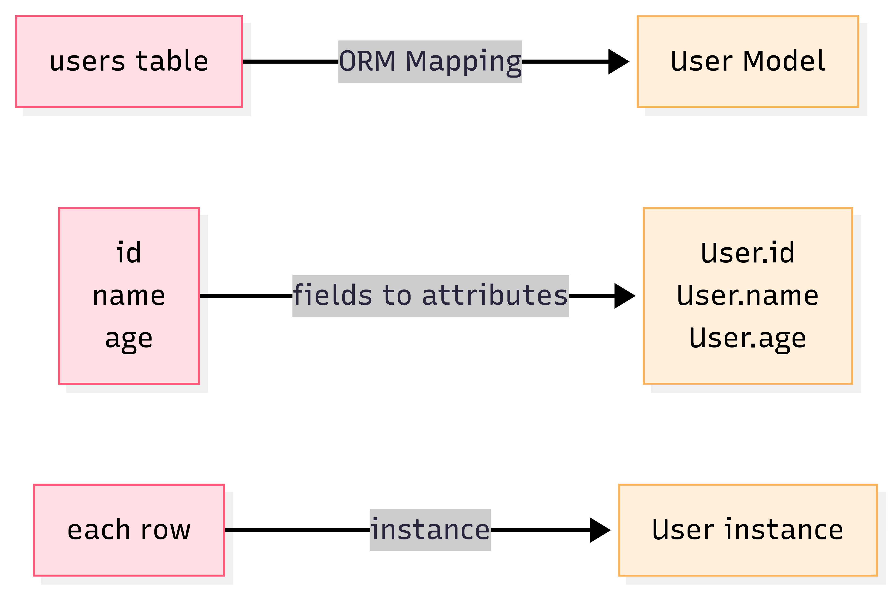

## ORM 是什麼？

在上一篇 [SQL 新手入門](/p/sql-crud-guide/)
裡，我們學會了用 SQL 操作資料庫的基本 CRUD，  
但當網站越寫越大，每次都要寫一大堆 SQL 指令，難免覺得繁瑣又容易出錯。

這時候使用 **ORM（Object-Relational Mapping，物件關聯對應）** 可以直接「操控」資料庫，不用每次都寫 SQL。

> - ORM (物件關聯對應) 顧名思義就是將關聯式資料庫(Relational Database )的資料，映射到物件(Object)之中。
> - 白話一點來說，就是 ORM 是一種技術，能把關聯式資料庫（Relational Database）裡的表格資料，自動轉換成程式語言裡的物件。這樣一來，你可以像操作 Python 的物件一樣，輕鬆進行資料的新增、查詢、修改和刪除，不需要再自己寫繁瑣的 SQL 指令。

---

在開始之前，我們來說說 SQL 有哪些缺陷以及 ORM 存在的必要性。

## 為什麼需要 ORM？

- 程式碼和 SQL 混在一起，難維護
- 常常拼錯 SQL，出錯找半天
- 不同資料庫 SQL 語法還不一樣
- 想用 Python 直接操作資料表、欄位

**ORM 出現後，你只要跟物件打交道，ORM 可以幫你自動轉換成 SQL。** (像是程式語言和資料庫中間的翻譯官)

---

## ORM 怎麼運作？

**"資料表" 好比一個 "Excel 表格"**

- ORM 幫你把「表格」翻譯成程式語言的「類別 Class」
- 「欄位」就像物件的「屬性 Attribute」
- 「一列資料」對應「一個類別的實例（object instance）」

**圖示說明：**



## ORM 物件與資料表關聯範例

**範例資料表 :**

| id  | name | age |
| --- | ---- | --- |
| 1   | Amy  | 25  |
| 2   | Bob  | 22  |

**Model 類別定義 (Django 為例) :**

```python
class User(models.Model):  # User model（類別，代表 users 資料表）
    name = models.CharField(max_length=50)  # 屬性1（attribute），對應 name 欄位
    age = models.IntegerField()             # 屬性2（attribute），對應 age 欄位
```

```python
user1 = User(id=1, name='Amy', age=25)  # 在Python中就會產生一個物件instance
user2 = User(id=2, name='Bob', age=22) # 產生另一個物件instance

```

> 資料表的每一列（row）＝ 一個物件（object instance）

## 用 ORM 操作資料庫 vs 傳統 SQL 對照

| 操作     | SQL 指令                                            | Django ORM 實作                                                           |
| -------- | --------------------------------------------------- | ------------------------------------------------------------------------- |
| 新增資料 | `INSERT INTO users (name, age) VALUES ('Amy', 25);` | `User.objects.create(name='Amy', age=25)`                                 |
| 查詢全部 | `SELECT * FROM users;`                              | `User.objects.all()`                                                      |
| 查詢特定 | `SELECT * FROM users WHERE age > 18;`               | `User.objects.filter(age__gt=18)`                                         |
| 更新資料 | `UPDATE users SET age=26 WHERE name='Amy';`         | `user = User.objects.get(name='Amy')`<br>`user.age = 26`<br>`user.save()` |
| 刪除資料 | `DELETE FROM users WHERE name='Amy';`               | `user = User.objects.get(name='Amy')`<br>`user.delete()`                  |

## Django ORM 基本語法示範

### 1️⃣ 定義 Model（資料表）

```python
from django.db import models

class User(models.Model):
    name = models.CharField(max_length=50)
    age = models.IntegerField()
```

### 2️⃣ 新增資料（Create）

```python
user = User.objects.create(name='Amy', age=25)
```

### 3️⃣ 查詢資料（Read）

```python
users = User.objects.all()  # 查全部
adults = User.objects.filter(age__gte=18)  # 查詢年齡大於等於 18 歲
```

### 4️⃣ 更新資料（Update）

```python
user = User.objects.get(name='Amy')
user.age = 26
user.save()
```

### 5️⃣ 刪除資料（Delete）

```
user = User.objects.get(name='Amy')
user.delete()
```

---

不過，雖然 ORM 讓資料庫操作更直覺、易讀，但在處理複雜查詢、效能優化或跨框架遷移時，
有時還是需要熟悉 SQL，才能避免隱藏的陷阱與效能瓶頸。

## ORM 的優缺點

| 優點                                         | 缺點                                                |
| -------------------------------------------- | --------------------------------------------------- |
| 1. 用程式語言操作資料表，直覺好讀            | 1. 某些複雜查詢 ORM 不夠彈性                        |
| 2. 可減少手寫 SQL 出錯                       | 2. ORM 產生的 SQL 可能不夠最佳化（N+1 問題）        |
| 3. 注入風險(資料被惡意指令篡改或竄改的危險)  | 3. 初學者容易忽略資料庫性能調校                     |
| 4. 資料庫換成 MySQL/PG/SQLite 幾乎不用改程式 | 4. ORM 有學習曲線＝剛學需適應新用法，熟悉後更順手。 |

> 補充：「N+1 問題」指 ORM 產生太多查詢，導致效能變差。可以用 select_related、prefetch_related 等優化。

## 常見 Q&A

### Q1. 用 ORM 就不用學 SQL 嗎？

基本 CRUD 沒問題，但遇到複雜查詢還是要補點 SQL 基礎，才能寫 raw SQL 或 debug ORM 問題。

### Q2. ORM 支援哪些資料庫？

常見如 MySQL、PostgreSQL、SQLite…各大框架 ORM 幾乎都支援。

### Q3. ORM 真的完全取代 SQL 嗎？

大多數情境可以，但像資料遷移（migrate）、複雜聚合或特殊優化，有時還是得用 SQL。

### Q4. ORM 會幫忙防止 SQL 注入嗎？

只要用 ORM 提供的查詢語法，不拼接字串，基本都能防注入！

## 腦力激盪

1. 用 ORM 新增一筆 User 資料，怎麼寫？

2. 怎麼查詢所有年齡大於 18 歲的使用者？

3. ORM 有哪些場景用起來比 SQL 方便？

4. 你遇過什麼 ORM 出錯的狀況？（如 N+1 查詢）

---

（參考答案）

1. 用 ORM 新增一筆 User 資料，怎麼寫？

```python
User.objects.create(name='Bob', age=22)
```

2. 怎麼查詢所有年齡大於 18 歲的使用者？

```python
User.objects.filter(age__gt=18)
```

3. ORM 有哪些場景用起來比 SQL 方便？

   - 直接存取 Python 物件屬性，不用再記一堆 SQL 字串

   - 結構調整（migrate）時，程式碼和資料表自動同步

   - 更容易撰寫單元測試

4. 你遇過什麼 ORM 出錯的狀況？（如 N+1 查詢）

   - 查詢關聯資料時產生大量 SQL（N+1 問題）

   - 條件寫錯，資料沒查到或誤刪

   - model 定義和資料表不同步導致錯誤

   - 忘記 save()、delete()，資料沒更新

## 延伸

這篇帶你入門 ORM 的原理與基本用法。如果你對資料庫「關聯」感興趣，之後將會介紹：

- 一對多、多對多資料表關聯怎麼設計？

- ORM 怎麼處理表關聯的查詢？

- ORM 進階優化技巧（如 select_related）
