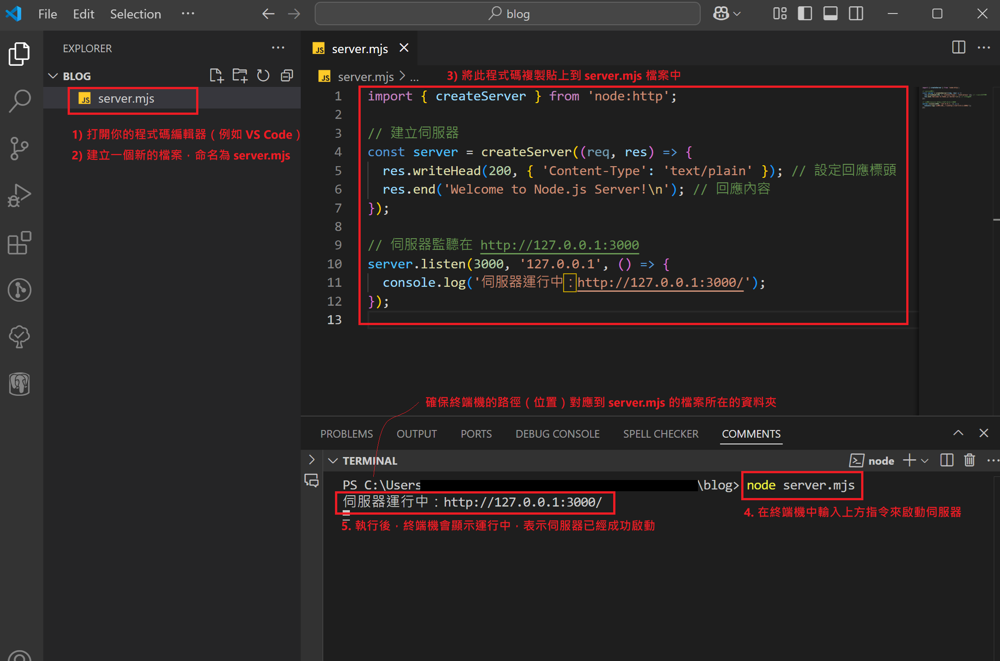

# 什麼是 Node.js？

簡單來說，**Node.js** 是一個讓你在電腦上執行 JavaScript 程式的工具。這跟你在網頁瀏覽器上看到的 JavaScript 不太一樣，因為它可以直接運行在電腦上，而不需要透過瀏覽器。

但它的用途遠不止於此~ 它讓 JavaScript 不再只限於瀏覽器內運行，而能用來開發功能強大的應用程式，例如伺服器、API 服務、工具應用等。

# Node.js 的優點

1. **非同步與事件驅動架構 (Asynchronous and Event-Driven)**：讓伺服器可以同時處理多個請求。  
2. **JavaScript 友好 (JavaScript-Friendly)**：如果你有點 JavaScript 基礎，在學習 Node.js 上會更上手!
3. **豐富的模組庫 (Rich Module Library, npm)**：可以使用數十萬個免費模組，現成的工具能幫你快速完成專案。

---

# 可以用 Node.js 做什麼？ 

1. **建立後端伺服器 (Build Backend Servers)**  
   透過 Node.js，你可以快速建立一個處理用戶請求的伺服器，像是處理資料上傳、提供網頁內容，甚至管理使用者帳號。

2. **即時應用 (Real-Time Applications)**  
   開發聊天系統、即時遊戲或即時通知等需要快速資料更新的應用程式。例如，你可以用 Node.js 開發一個多人聊天室。

3. **搭建 API (Build APIs)**  
   Node.js 常被用來構建 REST API 或 GraphQL API，這樣你的前端應用程式或其他服務可以和後端資料庫溝通。

4. **處理資料 (Handle Data)**  
   使用 Node.js，可以讀寫檔案、操作資料庫，甚至處理大量的資料流，像是處理影片或音訊檔案。

5. **自動化工具 (Automation Tools)**  
   你可以用 Node.js 寫腳本，幫助你完成一些繁瑣的工作，比如檔案壓縮、圖片批次處理或自動測試程式碼。

6. **構建桌面應用 (Build Desktop Applications)**  
   結合框架如 Electron，你可以用 Node.js 開發跨平台的桌面應用程式，例如 Visual Studio Code 就是用 Node.js 製作的。

7. **打造高效能網站 (Create High-Performance Websites)**  
   Node.js 能讓你建造能快速處理大量請求的網站，特別適合處理高流量的應用，例如購物網站或媒體平台。

8. **物聯網開發 (IoT Development)**  
   結合硬體裝置，Node.js 可用於開發 IoT 應用程式，像是連接智能設備並處理資料。

---


## 怎麼用 Node.js？ 

官網上的示範很簡單，以下是大致步驟：

1. **下載 Node.js（選擇 LTS）**  
   到 [Node.js 官網](https://nodejs.org) 下載並安裝 **LTS 版本**。

2. **檢查安裝是否成功**  
   打開終端機（Terminal 或命令提示字元），輸入以下指令：
   ```
   node -v
   ```
    如果顯示版本號（例如 v20.18.0），表示安裝成功！

3. **執行一段 JavaScript 程式**

    輸入:
    ```
    node
    ```
    按下Enter, 然後繼續輸入以下程式碼:
    ```
    console.log('Hello, Node.js!');
    ```
    按下Enter會看到程式輸出結果。

4. 還可以按照官網步驟**建立一個簡單的伺服器**
    ```js
    import { createServer } from 'node:http';
    //建立伺服器
    const server = createServer((req, res) => {
    res.writeHead(200, { 'Content-Type': 'text/plain' });
    res.end('Welcome to Node.js Server!\n');
    });
    // 伺服器在http://127.0.0.1:3000監聽
    server.listen(3000, '127.0.0.1', () => {
    console.log('伺服器運行中：http://127.0.0.1:3000/');
    });
    ```
    將以上程式碼存為server.mjs （檔名的副檔名 .mjs 是 Node.js 的 ES Module 格式），然後在終端機執行
    ```
    node server.mjs
    ```
    執行後，終端機會出現以下訊息，表示伺服器已經成功啟動:

    伺服器運行中：http://127.0.0.1:3000/

    打開就能看到訊息：Welcome to Node.js Server!


    如果想停止伺服器，回到終端機，按下 Ctrl + C

    這樣你就已經完成了一個簡單的HTTP伺服器了，當你在瀏覽器訪問http://127.0.0.1:3000時，伺服器會接到一個HTTP請求(request)。

    它會回應(response)一段文字: Welcom to Node.js Server!
---

> <示範> 我用VS Code編輯器



## 總結

Node.js 是一個強大又靈活的工具，不僅適合建立伺服器，還能用來開發各種應用程式。無論你是新手還是有經驗的開發者，Node.js 都能幫助你快速開發功能，讓網站和應用程式的效能更上一層樓！